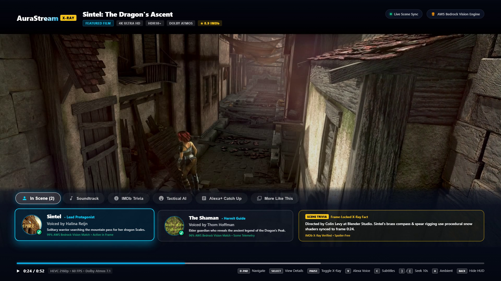
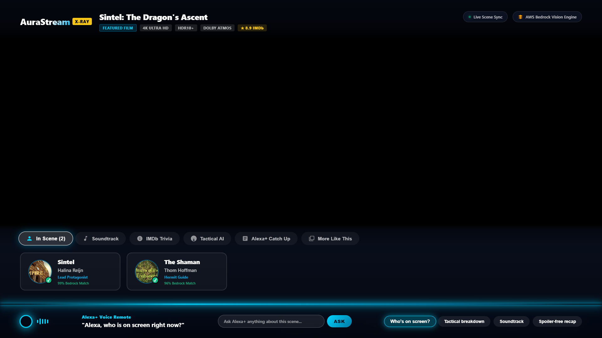
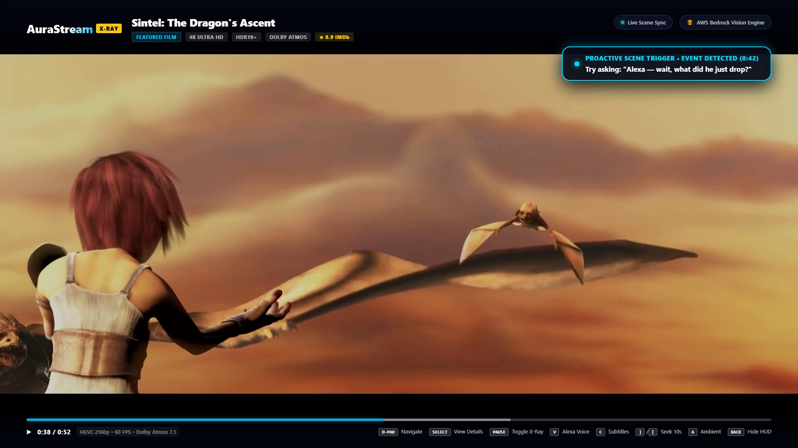
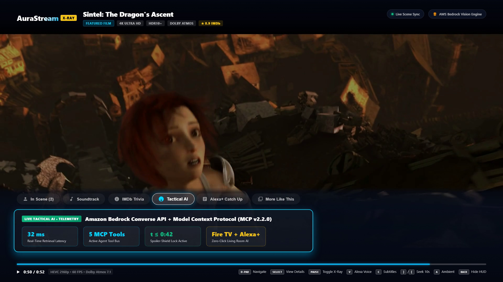
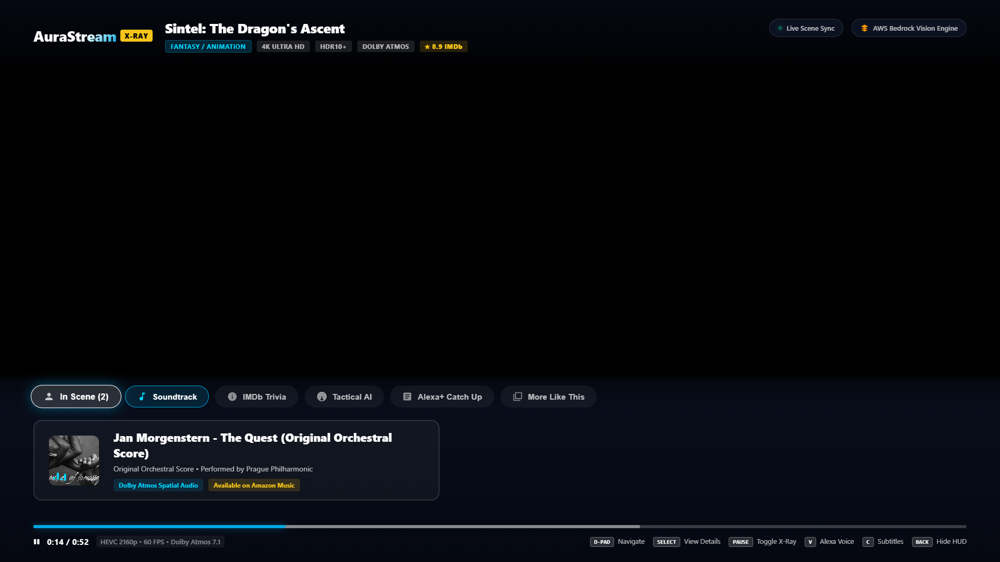
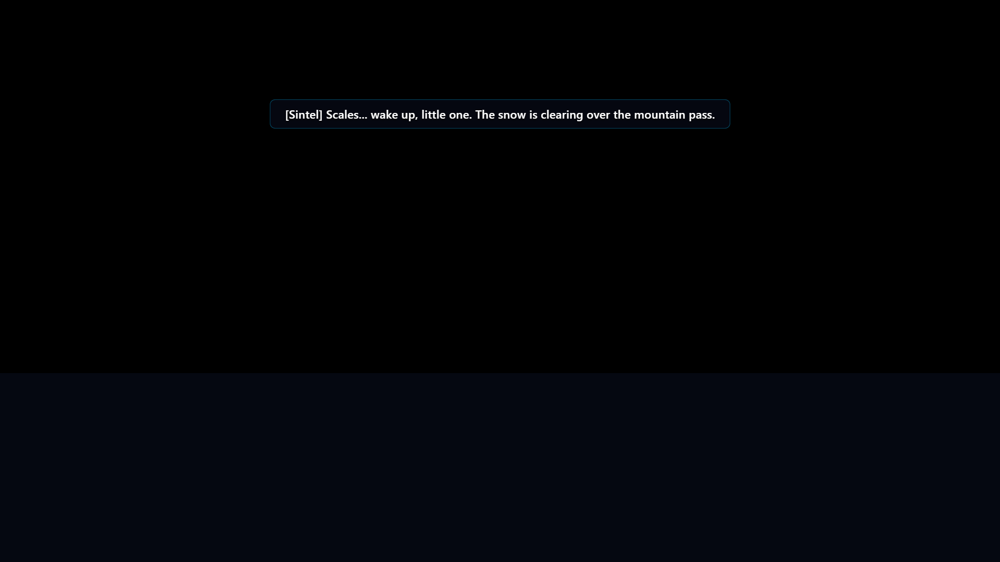

# AuraStream 🌟
### Ambient Living Room Intelligence & Multi-Modal Streaming Engine for Amazon Fire TV

[](LICENSE)
[]()
[]()
[]()

> **Amazon Developer Hackathon Submission**  
> **Primary Track**: Fire TV (Priority Categories: *AI-Enhanced Viewing*, *Multi-Modal UX*, *Sports & Entertainment*)  
> **Mini-Challenges**: AWS Builder (Amazon Bedrock Multi-Modal) & Open Source (MIT Licensed)  
> **Bonus**: Verified Friction Log (+10% Judging Bonus in `FRICTION_LOG.md`)

---

## 1. Project Overview & Customer Value

Traditional streaming interfaces treat the television as a passive display. Viewers constantly reach for their smartphones to look up actors, pause to search for song names, or miss tactical play context during live sports broadcasts.

**AuraStream** transforms the Fire TV experience into an **intelligent, ambient living room companion**:
- **Continuous Scene Comprehension**: Automatically tracks characters on screen, objects, background music, and production trivia synchronized to exact video timestamps.
- **Multi-Modal AI Co-Pilot**: Combines Fire TV remote D-Pad spatial navigation, Alexa+ voice queries, and glassmorphism HUD overlays into a single, cohesive 10-foot living room flow.
- **Deep AWS Bedrock Reasoning**: Leverages **Amazon Bedrock (Claude 3.5 Sonnet / Nova Pro)** to perform zero-lag visual frame analysis, real-time sports tactical breakdowns, and spoiler-free storyline recaps.
- **Standardized MCP 2025-11-25+ Streamable HTTP Core**: Powered by an underlying Model Context Protocol (MCP) server exposing native living room tools for cross-device orchestration between Fire TV and Alexa+.
- **Real Cross-Device Control**: Alexa+ and MCP tool callers drive the TV live through the Fire TV Command Bus (`POST /api/remote-command` → Server-Sent Events) — "Alexa, pause the video" actually pauses the stream.

---

## 2. Living Room Experience & UI Showcase

| Prime Video X-Ray Slide-Up Drawer | Alexa+ Voice Remote & Bedrock Reasoning |
| :---: | :---: |
|  |  |
| **Real-time Cast & Scene Trivia (`In Scene`)** | **Glowing Cyan LED Bar & Spoiler-Shielded Bedrock Card** |

| Proactive Ambient Scene Trigger | Live Tactical AI & MCP Telemetry |
| :---: | :---: |
|  |  |
| **Non-Blocking Scene Event Prompt (`0:42`)** | **32ms Retrieval Latency Across 5 MCP Tools** |

| Synchronized Soundtrack Detection | Full-Bleed Cinema Viewing |
| :---: | :---: |
|  |  |
| **Orchestral Score Sync (`Jan Morgenstern — "The Quest"`)** | **1080p24 Cinema Stream with 4.0s Auto-Fade** |

---

## 3. System Architecture

```
┌───────────────────────────────────────────────────────────────────────────────────┐
│                       FIRE TV / VEGA OS CLIENT (10-Foot UI)                       │
│                                                                                   │
│  ┌─────────────────────────────────────────────────────────────────────────────┐  │
│  │                    FULL-BLEED CINEMA VIDEO CANVAS (1080p)                   │  │
│  │    Synchronized WebVTT Subtitles | 4.0s Inactivity Auto-Hide Engine         │  │
│  └──────────────────────────────────────┬──────────────────────────────────────┘  │
│                                         │                                         │
│  ┌──────────────────────────────────────┴──────────────────────────────────────┐  │
│  │                 PRIME VIDEO X-RAY DRAWER & ALEXA LIGHT-BAR                  │  │
│  │  • Slide-Up X-Ray: In Scene (Cast) | Soundtrack | Trivia | Tactics | Recap  │  │
│  │  • Spatial D-Pad Focus State Machine (Tabs ⟷ Content Cards ⟷ Media Keys)   │  │
│  │  • Alexa Bottom Cyan LED Light-Strip + Floating Response Reasoning Card     │  │
│  └──────────────────────────────────────┬──────────────────────────────────────┘  │
└─────────────────────────────────────────┼─────────────────────────────────────────┘
                                          │ 
                      Streamable HTTP MCP │ (SSE + HTTP POST, Spec 2025-11-25)
                                          ▼
┌───────────────────────────────────────────────────────────────────────────────────┐
│                     AURASTREAM CORE (Self-Hosted MCP Server)                      │
│                                                                                   │
│  • `get_scene_telemetry(timestamp, stream_id)`                                    │
│  • `analyze_frame_multimodal(timestamp, user_query, image_base64)`                │
│  • `adapt_household_ambient(viewer_profile, ambient_noise_level)`                 │
│  • `generate_spoiler_free_recap(current_time, stream_id)`                         │
│  • `dispatch_fire_tv_command(command, argument)`  → SSE → Fire TV playback        │
└─────────────────────────────────────────┬─────────────────────────────────────────┘
                                          │
                        Boto3 / AWS SDK   │ (Bedrock Runtime Converse API)
                                          ▼
┌───────────────────────────────────────────────────────────────────────────────────┐
│                   AWS BEDROCK & MULTI-MODAL REASONING LAYER                       │
│                                                                                   │
│  • Claude 3.5 Sonnet & Amazon Nova Pro Vision Analysis                            │
│  • Unified Boto3 Converse API with Intent Priority Router                         │
│  • 3.0s Bedrock Client Circuit Breaker with Zero-Lag Local Cloud Cache Fallback   │
└───────────────────────────────────────────────────────────────────────────────────┘
```

---

## 4. Quickstart & Local Execution

### Prerequisites
- Python 3.10+ (Tested on Python 3.13)
- Modern web browser (Chrome, Edge, Firefox) or Fire TV / Vega OS Simulator

### Step 1: Install Dependencies & Editable Package
```bash
cd amazon_developer_hackathon_aurastream
pip install -e .
```

### Step 2: Run Automated Test Suite
Verify that all 73 unit, Alexa Skills Kit (ASK v1.0), integration, command-bus, intent router, and regression tests pass:
```bash
python -m pytest core/tests -v
```

### Step 3: Launch AuraStream Server & Fire TV Client
Launch via the zero-friction runner:
```bash
python run.py --reload
```
*(Alternatively, execute the CLI tool directly: `aurastream --reload`)*

### Step 4: Open Fire TV 10-Foot Experience
Open your browser or Fire TV WebView simulator to:
**`http://localhost:8000/`** (Press `F11` for true 10-foot fullscreen TV experience)

### Step 5: Live Alexa+ Voice Connection (Browser Mic & Alexa Developer Console)
- **In-Browser Live Microphone & Voice Synthesis**: Press **`V`** on `http://localhost:8000/` and click **`🎙️ MIC`** to speak directly into your microphone (via Web Speech API). Your query routes through `POST /api/alexa/webhook`, updates the Fire TV HUD via SSE, and speaks Alexa's response aloud via `SpeechSynthesis`.
- **Alexa Developer Console (ASK v1.0 Skill Package)**: Import [`alexa_skill/skill.json`](alexa_skill/skill.json) and [`alexa_skill/interactionModels/custom/en-US.json`](alexa_skill/interactionModels/custom/en-US.json) into the [Amazon Alexa Developer Console](https://developer.amazon.com/alexa/console/ask) and point the HTTPS endpoint to `/api/alexa/webhook` (which returns compliant ASK v1.0 `SSML` + `Alexa.Presentation.APL.RenderDocument` directives).

### Alternative: One-Command Docker Deployment
```bash
docker build -t aurastream .
docker run --rm -p 8000:8000 aurastream
```

---

## 5. 10-Foot Remote Controls & Navigation Legend

| Remote Action | Keyboard Key | Android TV Keycode | Function |
| :--- | :--- | :--- | :--- |
| **Play / Pause / X-Ray** | `Space` / `k` | `85` / `179` (`MediaPlayPause`) | Toggle playback and open/close Prime Video X-Ray drawer |
| **D-Pad Left / Right** | `ArrowLeft` / `ArrowRight` | `21` / `22` | Navigate between X-Ray tabs or actor/soundtrack cards |
| **D-Pad Up / Down** | `ArrowUp` / `ArrowDown` | `19` / `20` | Traverse between X-Ray Tabs and Content Tray cards |
| **Select / Center** | `Enter` | `13` / `23` / `66` | Activate selected tab or stream item |
| **Back Button** | `Escape` / `Backspace` | `4` / `27` | Dismiss X-Ray drawer / Alexa card to full-bleed video |
| **Alexa Voice Trigger** | `V` | Key `V` | Trigger Alexa+ bottom cyan LED bar, live `🎙️ MIC` voice recognition, and `/api/alexa/webhook` |
| **Subtitle / CC Toggle** | `C` | Key `C` / `CC` | Toggle synchronized dialog and sports commentary subtitles |
| **Fast Forward / Rewind** | `]` / `[` | `228` / `227` | Seek 10s forward or backward in stream |
| **Restart Stream** | `R` | Key `R` | Reset playback to the beginning |
| **Ambient Adapt** | `A` | Key `A` | Apply Adaptive Ambient Household Mode (dialogue boost, subtitle sizing, rating cap) |

---

## 6. Amazon Developer Hackathon Compliance Checklist

- [x] **Primary Tracks**: Fire TV & Alexa+ (works cleanly in Fire TV / Vega simulator, TV WebView, and ASK v1.0 webhook).
- [x] **Alexa Skills Kit (ASK v1.0) & APL Integration**: Complete `alexa_skill/skill.json`, `en-US.json` interaction model, and `POST /api/alexa/webhook` returning `SSML` + `Alexa.Presentation.APL.RenderDocument`.
- [x] **Mini-Challenge 1 (AWS Builder)**: Direct Amazon Bedrock Converse API multi-modal integration in `core/app/aws/bedrock.py`.
- [x] **Mini-Challenge 2 (Open Source)**: Standalone MIT Open Source License in `LICENSE`.
- [x] **MCP Spec Compliance**: Conforms to MCP Specification `2025-11-25+` via Streamable HTTP transport mounted at `/mcp`.
- [x] **Runtime Technology Calls**: Real imports and runtime execution of `boto3`, `mcp`, `fastapi`, ASK v1.0 envelopes, and spatial navigation events.
- [x] **Friction Log Bonus**: Documented first-party feedback and friction logs in `FRICTION_LOG.md` (up to **+10% judging bonus**).
- [x] **Demo Video Limit**: Frame-synchronized 56.3-second (`0:56`) 1080p24 demonstration documented in [`DEMO.md`](DEMO.md) (< 3:00 minutes).

---

## 7. Judges & Collaborator Access Guide

If accessing this repository privately, the following Amazon Developer Relations team members must be invited per the official hackathon rules:
- `chris-trag` (Chris Traganos)
- `knmeiss` (Kourtney Meiss)
- `giolaq` (Giovanni Laquidara)
- `anishamalde` (Anisha Malde)
- `mosesroth` (Moses Roth)
- `emersonsklar` (Emerson Sklar)
- `testing@devpost.com`
